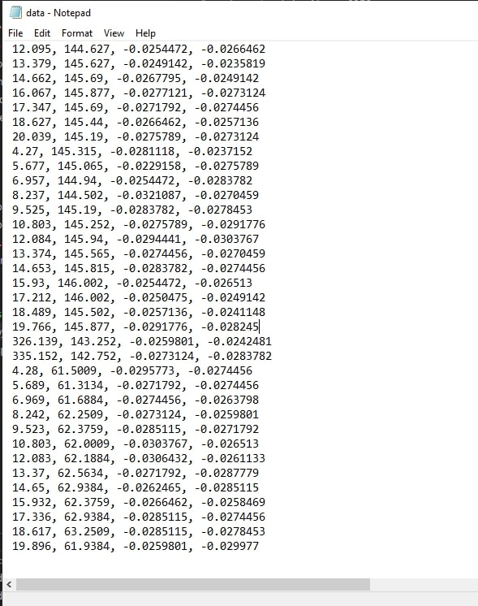
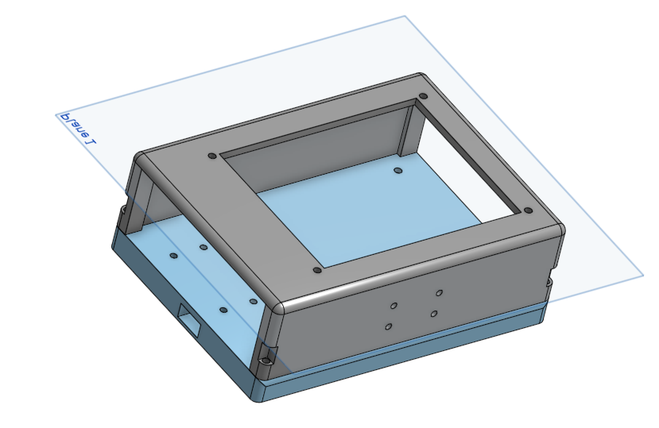

# max-and-callen Pole Vaulting Pi


### Description
This is Mondo Duplantis. He is currently the best pole vaulter in the world with a hieght of a little over 20 feet. Our main question is what makes Mondo so hot and how we can be more like him using the power and wonder of engineering. In our best hopes we will be able to use the metrics from our sensor to figure out how virtical we are getting and how fast we are accelerating through the vault. We will measure our position on the ground during takeoff and continhual postion throught the air, and compare this with the sucess of our jump. Throught this we will be able to optimize our pole vault.

## Proof of concept

!


 
 
 
 ```python
import time #imports stuff
import board
import adafruit_mpu6050
import busio

sda_pin = board.GP14  #sets up i2c
scl_pin = board.GP15
i2c = busio.I2C(scl_pin, sda_pin)  #sets up accelerometer
mpu = adafruit_mpu6050.MPU6050(i2c)

while True:
    print("Acceleration: X:%.2f, Y: %.2f, Z: %.2f m/s^2" % (mpu.acceleration))
    print("Gyro X:%.2f, Y: %.2f, Z: %.2f rad/s" % (mpu.gyro))  #things serial monitor needs to read
    print("Temperature: %.2f C" % mpu.temperature)
    print("")
    time.sleep(1)

```

## Bill of matierals
*Not including pole vault tools

-Strap to attacth pi to our bodies
- Rasberry pi
- Acceleraomoter
- Necesary wiring 
- Box to protect wiring

## What is success for this project?
For this project a sucess will be that we can accurately record the postion of ourselves on takeoff, and in the air, during the polevault, and compare this with the sucess of our jump (Measured by height cleared.) By compaing these hopefully we can optimize our own jumps and hit big time personal bests by finding the best take off postion/positoin in the air.

## Safety? 
Assuming safe polevaulting, the safety for this project lies with the safety of the pi on impact and in the air. We will be sure to protect the pi in a way that it will not break on impact using a box, and strap it tight to our bodies so it will not fall off. 

## Images


### Our Progress 


## Week One
This week we have created several prototypes and found out what has to be done in order to make the most stable glider we can make. from our first to our second design there are things we need to fix be this weekend we are hoping to find some foam board we can use the make a better and possible final prototype.


## Week Two
We spent the week working on a prototype for a gliding plane, but our efforts were unsuccessful due to the foam we used being too heavy. We started by sketching out our design and gathering the materials we would need. we carefully followed our plans and began assembling the prototype, but as we were putting the finishing touches on it, we realized that the foam was too dense and was causing the plane to be too heavy. We tested it out and the plane crashed as soon as we launched it. We were disappointed by the result, but we learned a valuable lesson about the importance of using the right materials in mour design. We will have to find a lighter foam to use in our next prototype.


## Week Three
In week three we took a complete 180 for our project. We are switching from our glider to us being the pi in the sky. We are both pole vaulters and we want to attatch a pico to ourselves and measure the data and our postions in the air to optimize our polevaulting ability. We switched to this project because it is more unique and interesting than just a glider, and we are more passionate about this.


## Week Four
In week four callan went to new york and I had a some work to do for the cern trip so this was an off week. I did manage to get the acclerameter working again and start design on the holder for our pi and sensors. We are hoping to attach it to a go pro chest strap which I have and I will try and find this so we can print and test the casing.


## Week Five
We are still behind schedule this week we are close to finishing the design for our holder. We have also bought a go pro chest strap because my brother has mine. next week we hope to put our data into excel and start testing.

## Week Six 
We are catching up this week we are nearing completion on the design for the sensor casing. We now have the chest strap so we can better visualize what we want to do with it. We have also gotten the barrometer work along with a time stamp and accelerameter. Now we need to start putting the peices together and figure out how to save our data and plot it.

## Week Seven
Using an altimeter and acceleramtoer we now can collect height, and x and z acceleration values. This is a big step in collecting data of our jumps. We also have a time.monotnic to cross refernce with our data. We now are working on a way to save the data, and plot it. We also need to figure out how to turn x and z accleration into velociy and position. 




## Week 8 
This week we figured out how to collect and save the data in a data.txt file. We can now easily input the data into Excel and plot it into graphs as nececsary. The 3d printed box is almost finalized and ready to print. All we have left is soldering our wiring, printing our box to hold the wiring, and converting x and z acceleration into postion values.


## Week 9
This week callan and I went to states (I was not participating sadly). States taught us a lot about how far we have to go in our pole vaulting journey and it starts with this project. We are currently in the process of printing and assembling our first prototype. We are going to start testing soon and record data to see if we can find anything.

## Week 10 
We now have our code and design finalized and we are just waiting for our box to print. All thats left after that is hopefully just testing and optimization. At worst well have to fix a few things and do some tweaks. We also tested as seen below

##



Optimized Design

## Week 11
Our optimized design is now printed and constructed, the battery pack didn't fit so we had to do some minor configuring, but everything is now ready for testing, and that is all we have to do. 


## Schedule 
Week 3: Finalize design idea, what we are measuring, finish github. 
Week 4: Start coding and design 
Week 5: Print peices of holder, finalizr code
Week 6: Work on/finish inital prototypr
Weeks 7-8: Dependent on sucess, work out kinks and upgrade. Use collected data and compare with sucess of jumps, start documentation and measuring of progress
Week 8-10: Continue to optimize jumps through collected data while documenting.
