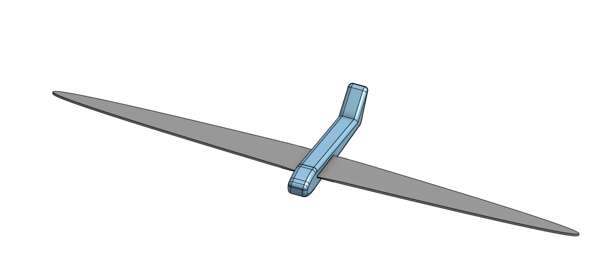
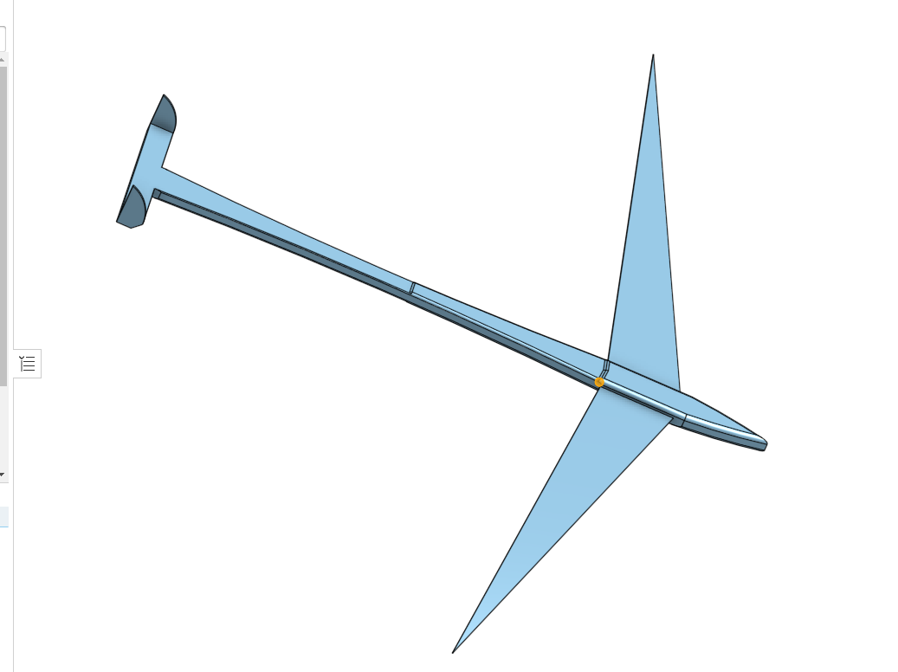
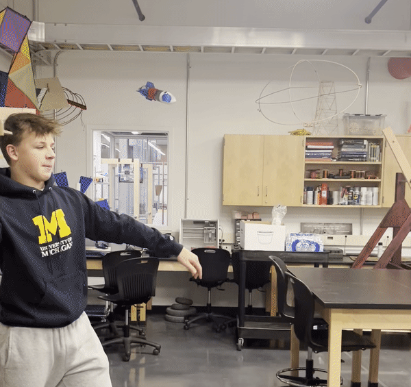

# max-and-callen

# Planning 

## Inital Desgin

### Image

### Description
This is our inital design, it is not to scale but is more of a concept sketch. A good power to wieght ratio for gliders or light and slow-flying model aircraft, a ratio of between 0.3: 1 to 0.4: 1.

## Testing

 

 
 
 
  

### We are currently expiramenting to find the best design for maxium flight time stability and distance. We know our glider will likely be made out of some sort of foam and other than the mateirals we need to collect data. 

''import board  #import shit
import adafruit_mpu6050
import busio 
import time
import digitalio 
import terminalio
import displayio
from adafruit_display_text import label
import adafruit_displayio_ssd1306

displayio.release_displays()
sda_pin = board.GP14   #setup pico
scl_pin = board.GP15
i2c = busio.I2C(scl_pin, sda_pin)
display_bus = displayio.I2CDisplay(i2c, device_address=0x3d, reset=board.GP28)
display = adafruit_displayio_ssd1306.SSD1306(display_bus, width=128, height=64)
led_red = digitalio.DigitalInOut(board.GP18)   #led setup
led_red.direction = digitalio.Direction.OUTPUT

mpu = adafruit_mpu6050.MPU6050(i2c, address=0x68) #accelerometer

while True:
    print(mpu.acceleration)   #say the values
    time.sleep(.5)
    print("Gyro X:%.2f, Y: %.2f, Z: %.2f rad/s" % (mpu.gyro))
    splash = displayio.Group()  #create the display group

    title = "ANGULAR VELOCITY" #add title block to display group
    text_area = label.Label(terminalio.FONT, text=title, color=0xFFFF00, x=5, y=5)
    splash.append(text_area) 

    title = f"x: {mpu.gyro[0]}" 
    text_area = label.Label(terminalio.FONT, text=title, color=0xFFFF00, x=5, y=15) # determines and prints x value
    splash.append(text_area)  
    
    title = f"y: {mpu.gyro[0]}" 
    text_area = label.Label(terminalio.FONT, text=title, color=0xFFFF00, x=5, y=30) # figures and and says y value
    splash.append(text_area) 

    title = f"z: {mpu.gyro[0]}" 
    text_area = label.Label(terminalio.FONT, text=title, color=0xFFFF00, x=5, y=45) # same thing with z
    splash.append(text_area)

    display.show(splash) #send display group to screen
    if mpu.acceleration[0] < -9 or mpu.acceleration[0] > 9:
        led_red.value = True  #at 90 degrees led is on

    else:
        led_red.value = False  #if not led is off''
        
