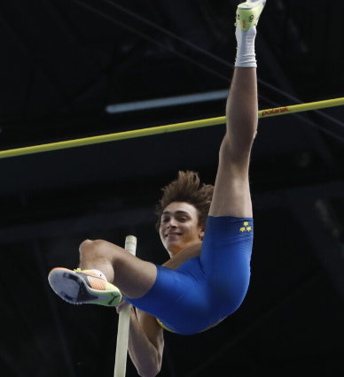
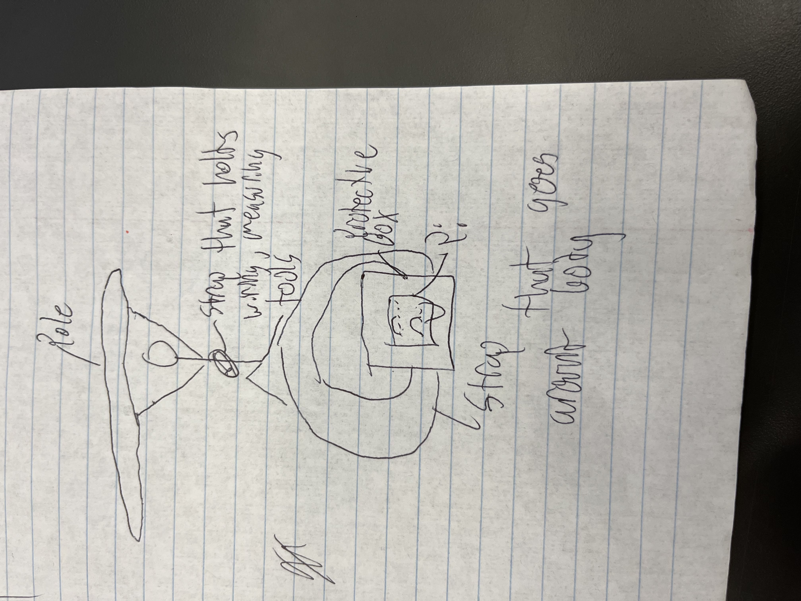

# max-and-callen Pole Vaulting Pi

### Description
This is Mondo Duplantis. He is currently the best pole vaulter in the world with a hieght of a little over 20 feet. Our main question is what makes Mondo so hot and how we can be more like him using the power and wonder of engineering. In our best hopes we will be able to use the metrics from our sensor to figure out how virtical we are getting and how fast we are accelerating through the vault. We will measure our position on the ground during takeoff and continhual postion throught the air, and compare this with the sucess of our jump. Throught this we will be able to optimize our pole vault.

## Proof of concept

!

 
 

## Bill of matierals
*Not including pole vault tools

-Strap to attacth pi to our bodies
- Rasberry pi
- Acceleraomoter
- Necesary wiring 
- Box to protect wiring

## What is success for this project?
For this project a sucess will be that we can accurately record the postion of ourselves on takeoff, and in the air, during the polevault, and compare this with the sucess of our jump (Measured by height cleared.) By compaing these hopefully we can optimize our own jumps and hit big time personal bests by finding the best take off postion/positoin in the air.

## Safety? 
Assuming safe polevaulting, the safety for this project lies with the safety of the pi on impact and in the air. We will be sure to protect the pi in a way that it will not break on impact using a box, and strap it tight to our bodies so it will not fall off. 

## Images

### Our Progress 

## Week One
This week we have created several prototypes and found out what has to be done in order to make the most stable glider we can make. from our first to our second design there are things we need to fix be this weekend we are hoping to find some foam board we can use the make a better and possible final prototype.

## Week Two
We spent the week working on a prototype for a gliding plane, but our efforts were unsuccessful due to the foam we used being too heavy. We started by sketching out our design and gathering the materials we would need. we carefully followed our plans and began assembling the prototype, but as we were putting the finishing touches on it, we realized that the foam was too dense and was causing the plane to be too heavy. We tested it out and the plane crashed as soon as we launched it. We were disappointed by the result, but we learned a valuable lesson about the importance of using the right materials in mour design. We will have to find a lighter foam to use in our next prototype.

## week three
In week three we took a complete 180 for our project. We are switching from our glider to us being the pi in the sky. We are both pole vaulters and we want to attatch a pico to ourselves and measure the data and our postions in the air to optimize our polevaulting ability. We switched to this project because it is more unique and interesting than just a glider, and we are more passionate about this.
